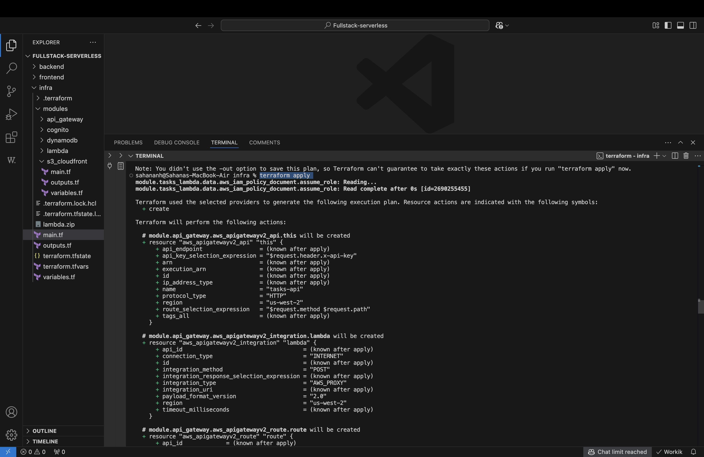

# Taskify Cloud – Serverless Fullstack App (Terraform-AWS)

A modern, fullstack CRUD application built using **React**, **AWS Lambda**, **API Gateway**, **DynamoDB**, **S3**, and **CloudFront** — fully deployed with **Terraform**.

---


## 🚀 Deploy AWS Infrastructure with Terraform

**Prerequisites:**  
- [AWS CLI configured](https://docs.aws.amazon.com/cli/latest/userguide/cli-configure-quickstart.html)  
- [Terraform installed](https://www.terraform.io/downloads)

```bash
cd infra
terraform init
terraform apply
```





This provisions **DynamoDB, Lambda, API Gateway, S3, CloudFront** (and Cognito if enabled).

> **Note:**  
> After `terraform apply`, note down the outputs for API endpoint, S3 bucket, and [optional] Cognito IDs.

---

## 🔧 Backend: Deploy Lambda Function

```bash
cd backend
# Install dependencies
npm install
# Bundle as lambda.zip
zip -r lambda.zip tasks.js node_modules/
# Move/copy lambda.zip to correct path for Terraform
cp lambda.zip ../infra/lambda.zip
# Re-run terraform if needed: (from infra/)
cd ../infra
terraform apply
```

---

## 🌐 Frontend: Build & Deploy React App

```bash
cd frontend
npm install
npm run build
# Sync build/ to S3 bucket (replace <bucket-name>)
aws s3 sync build/ s3://<bucket-name-from-terraform-output>
```

Visit the CloudFront URL from your Terraform outputs!


---

## 🧪 Local Development

Start React dev server:

```bash
cd frontend
npm start
```

- Lambda/API runs in AWS — make sure **CORS is enabled on API Gateway** for local testing.

---

## 🛠️ Tech Stack

- **Frontend:** React (18.x), Axios, CSS-in-JS
- **Backend:** AWS Lambda (Node.js), DynamoDB, API Gateway
- **Infra:** Terraform, AWS S3, CloudFront, [Optional: Cognito]

---

## 💡 Customization Ideas

- Add user authentication (Cognito)
- Multi-user task lists
- Real-time updates (WebSocket API)
- Notifications or reminders

---


